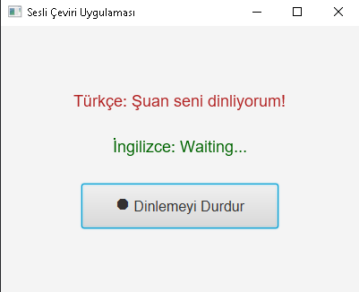
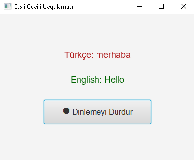

# Voice Translation App 🎤🌍

This project is a **real-time voice translation** application built using **JavaFX**.  
It listens to Turkish speech and instantly translates it into English.

## Features

- 🎧 **Real-time voice listening**
- 📝 **Automatic translation from Turkish to English**
- 🎨 **User-friendly modern interface**
- 🔄 **Start/Stop listening control**
- ⚡ **Responsive UI with JavaFX**
- 🌐 **Free translation using Lingva.ml API**

## Technologies Used

- Java 17+
- JavaFX
- Vosk Speech Recognition
- Lingva.ml Translation API

## Screenshots

|             Before Listening             | While Listening |
|:----------------------------------------:|:---------------:|
|  |  |

## How to Run

1. Install Java 17 or higher.
2. Clone the project:

    ```bash
    git clone https://github.com/yourusername/project-name.git
    ```

3. Open it with an IDE like IntelliJ IDEA.
4. Download and place the required Vosk model (`vosk-model-small-tr-0.3`) inside the resources folder.
5. Run the `Main` class (`TranscriberApp`).

## Notes

- **Lingva.ml** is an open-source and free translation service.
- A small-sized Turkish model is included; for higher accuracy, larger models can be used.
- The application requires microphone access.

## Contributing

Contributions are welcome! 🎯  
Feel free to create issues or open pull requests for improvements.

---

**Developer**: [Mustafa Bingül](https://github.com/mustafabinguldev)
